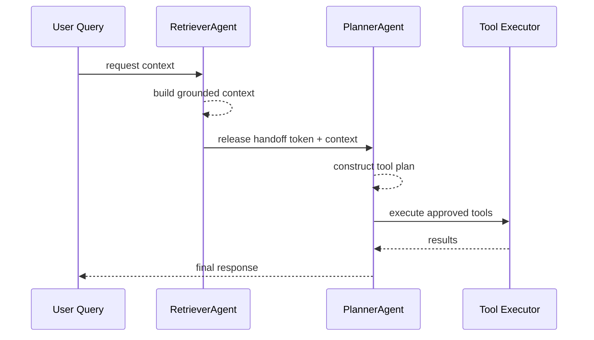

1. Complexity and Trade-offs of all solution attempts, with the main emphasis on the last attempt.

Attempt A (`FooBar` with `AtomicBool` + `AtomicI32`, current final attempt):
- Per-call time is O(1) for a single `foo()` or `bar()` invocation (one CAS + one load + optional print + optional increment).
- Space is O(1).
- Main trade-off: lock-free primitives reduce lock overhead, but correctness burden shifts to turn-state invariants and retry/wait policy.
- Critical issue: each method currently performs at most one attempt and returns immediately. The LeetCode contract requires each side to print `n` times with strict alternation, which needs a loop/retry/wait strategy.
- Behavior risk: `foo()` does not increment the counter, while `bar()` does. This can work only if counter semantics are rigorously defined (e.g., “completed pairs”), but current state transitions do not enforce that model end-to-end.
- Edge behavior: once `counter >= n`, a successful CAS can still flip `flag` before the `< n` guard short-circuits, potentially leaving turn state inconsistent at termination.

Attempt B (`FooBar2` scaffold):
- Not implemented (`todo!`), so complexity is undefined for the target behavior.
- Trade-off: trait/interface is clean, but no execution logic means no correctness guarantees.

2. Critique of the problem-solving approach, including progression of thought and method.

- Positive progression: you moved from pure compile scaffolding to concrete atomic synchronization primitives, which is the right direction for this problem family.
- Good instinct: using CAS on a turn flag indicates you’re modeling ownership of “whose turn is next,” which is the key invariant.
- Main gap: the problem is inherently iterative across `n` turns, but the final attempt is modeled as a single-shot check in each method. That mismatch is the core correctness break.
- Main logic ambiguity: counter meaning is not fully pinned down. In this problem, either “pair index,” “bar count,” or “completed total prints” can work, but each requires different increment/check points.
- Concurrency gap: there is no waiting/backoff/yield strategy after failed CAS, so losing a race currently means silent return instead of eventual progress.
- Testing gap: existing tests are scaffold-level and ignored for behavior. No stress test currently validates exact output sequence length/order.

3. Improvements to Algorithm/ Optimal Example (include python solution code here in ``` ``` grouping braces)

```python
from threading import Semaphore

class FooBar:
    def __init__(self, n: int):
        self.n = n
        self.foo_sem = Semaphore(1)
        self.bar_sem = Semaphore(0)

    def foo(self, printFoo: 'Callable[[], None]') -> None:
        for _ in range(self.n):
            self.foo_sem.acquire()
            printFoo()
            self.bar_sem.release()

    def bar(self, printBar: 'Callable[[], None]') -> None:
        for _ in range(self.n):
            self.bar_sem.acquire()
            printBar()
            self.foo_sem.release()
```

- Why this is optimal for interview constraints:
- O(n) total prints, O(1) shared state.
- Explicit alternation invariant via permit transfer (`foo_sem -> bar_sem -> foo_sem ...`).
- No busy-spin; blocking synchronization avoids wasting CPU.

4. Applications in real-life situations, including AI-agent and engineering potential applications in 2026. Include examples from big tech and startups (frontier tech) for the exact problem and the generalized pattern. Be critical and outline tradeoffs, when to use this algorithm/design, and when not to use it.

- Transferable systems pattern:
- Deterministic two-party handoff (token/permit passing) where stage B must wait for stage A completion.

- Literal usage vs analogy:
- Literal: two-thread ordered output or two-stage pipeline with strict alternation.
- Partial analogy: multi-stage distributed workflows, where strict alternation generalizes to dependency-gated execution (not necessarily one-to-one ping-pong).

- What is its usefulness in designing large-scale data-driven applications?
- It is useful as a minimal coordination primitive for enforcing causality and order between dependent stages. In large-scale systems, this maps conceptually to durable event offsets, workflow state machines, or queue acknowledgment chains rather than direct thread semaphores.

- Concrete examples:
- Big-tech-scale infrastructure example: a log ingestion pipeline where parse stage must complete before schema-enrichment stage consumes the same record shard; the production form is partitioned queues + offset commits (conceptual mapping), not in-process semaphores.
- Startup/frontier-tech example: a real-time voice agent startup coordinating “ASR chunk finalized” before “tool-augmented response planning” for each turn; strict gating reduces hallucinated tool calls from partial transcripts.

- Explicit 2026 AI-agent application mapping:
- In multi-agent orchestration, use a handoff token so `RetrieverAgent` must finish context packaging before `PlannerAgent` emits executable tool routes. This is a direct pattern for local orchestrators, and a conceptual pattern for distributed agent runtimes.

- Concise application case (context -> design choice -> outcome):
- Context/constraint: low-latency agent runtime (<250 ms planning budget) with costly downstream tool calls.
- Choice: enforce a two-stage readiness gate (retrieve complete -> plan allowed) using permit-style orchestration state.
- Expected outcome: fewer invalid tool invocations, more stable latency variance, slightly reduced peak throughput due to stricter gating.



- When to use vs not use:
- Use when correctness requires strict ordering between small number of stages and blocking is acceptable.
- Do not use when high fan-out, variable-latency stages need asynchronous buffering and independent scaling.
- AI-agent counterexample (do not use this approach): speculative multi-tool planning where planner should launch independent tools concurrently; strict alternation would underutilize parallelism and hurt latency.

5. Open Questions to Challenge My Understanding (non-spoiler). Ask 3-6 targeted questions tied to likely blind spots from my solution and reasoning.

- In your current `foo()`, after a successful CAS, under what exact state combinations can the function return without printing, and what invariant does that violate?
- If `counter` models completed `"foobar"` pairs, which method(s) should be allowed to increment it, and why?
- What progress guarantee do your methods currently provide after a failed CAS: wait-free, lock-free, obstruction-free, or none for the overall required behavior?
- How would you prove that exactly `2n` prints occur with no duplicates and no missing symbols?
- Under what scheduling scenario could your current one-shot methods terminate both threads early while still leaving required prints undone?

6. Next-Step Application Challenges (Similar but Variant) with Learning-Goal Intent. Provide 2-4 concise challenge prompts that are close to the current problem but differ in one key dimension (constraints, interface, mutability, streaming, memory, distributed setting, etc.). For each challenge include:
- Learning goal intent
- What changed from the original problem
- Why this change matters for design decisions

- Challenge: `foo`, `bar`, `baz` must print in order for `n` rounds.
- Learning goal intent: generalize 2-party alternation into k-stage deterministic handoff.
- What changed from the original problem: number of coordinated participants changed from 2 to 3.
- Why this change matters for design decisions: binary turn flags become brittle; semaphore/ring-index/state-machine designs become clearer.

- Challenge: same `foo`/`bar`, but each print may block unpredictably (simulated I/O).
- Learning goal intent: reason about throughput vs strict ordering under variable latency.
- What changed from the original problem: callback cost is no longer near-constant.
- Why this change matters for design decisions: busy-spinning becomes expensive; blocking primitives and fairness policy matter more.

- Challenge: distributed variant where `foo` and `bar` run in separate processes communicating over a message bus.
- Learning goal intent: transfer in-process synchronization concepts to durable/event-driven coordination.
- What changed from the original problem: shared-memory atomics are unavailable; failures and retries are first-class.
- Why this change matters for design decisions: ordering requires idempotency keys, sequence numbers, and replay-safe state transitions.
