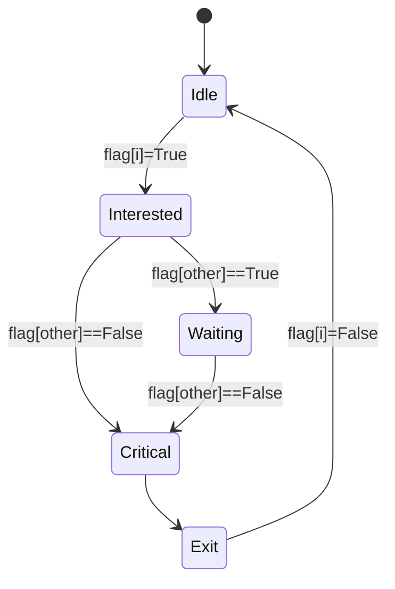
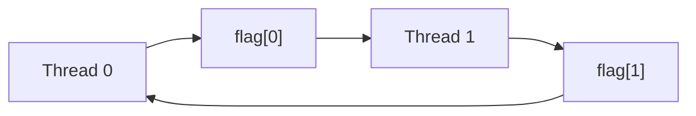
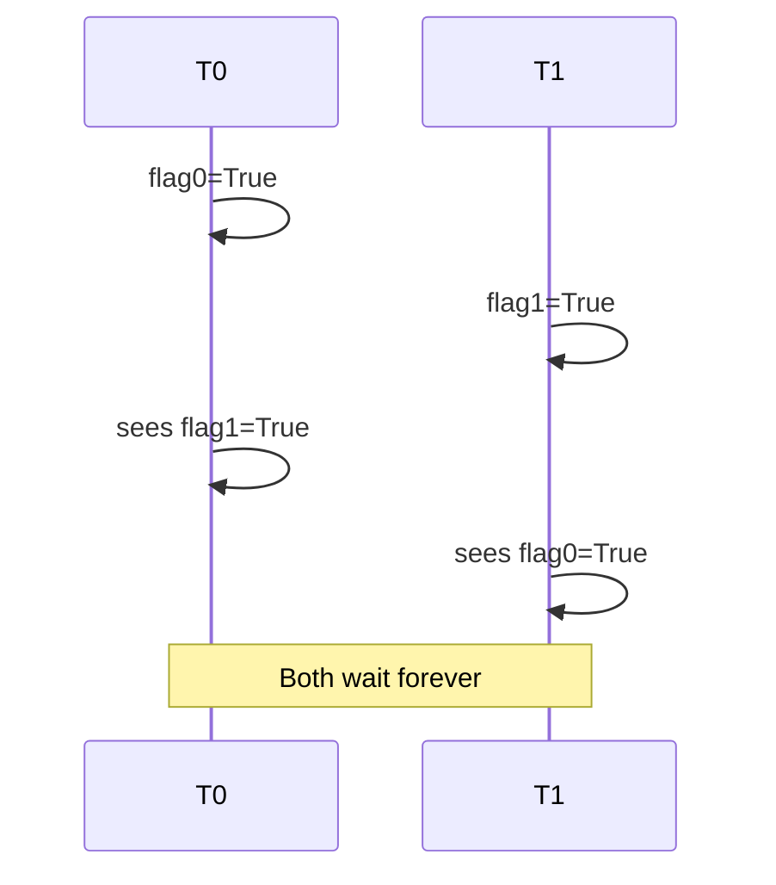
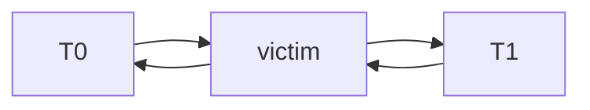
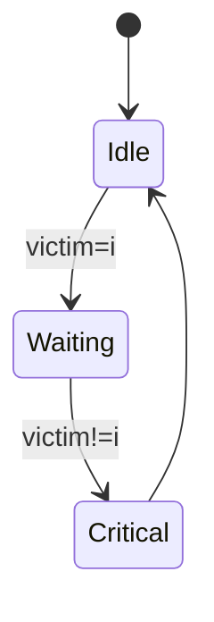
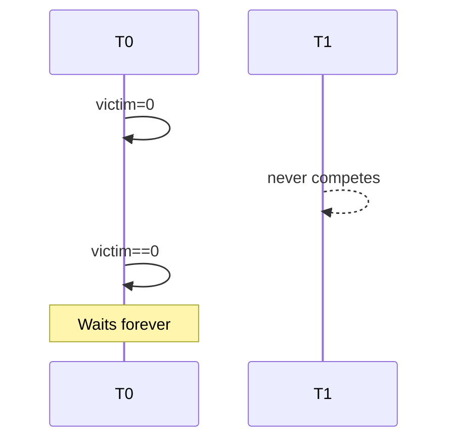
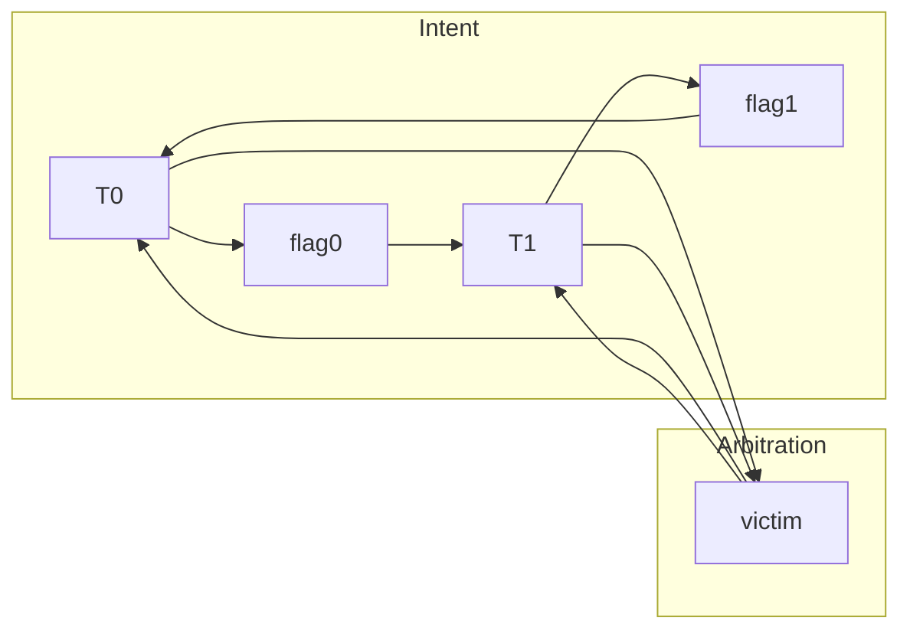
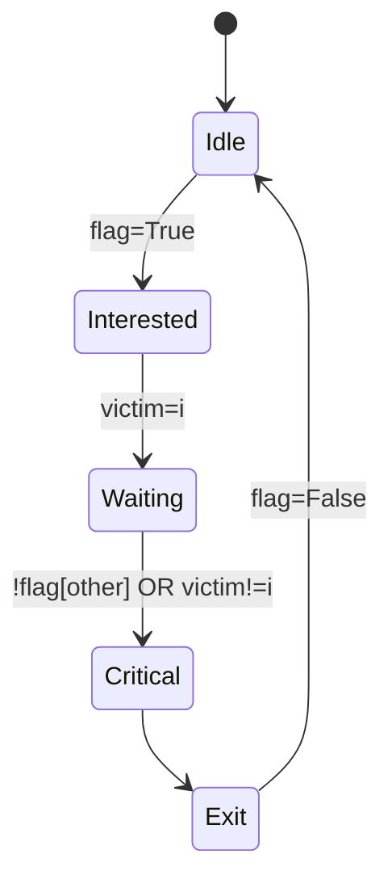
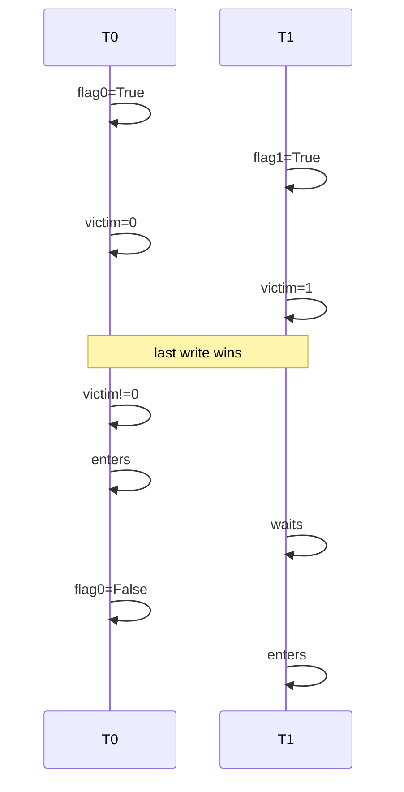
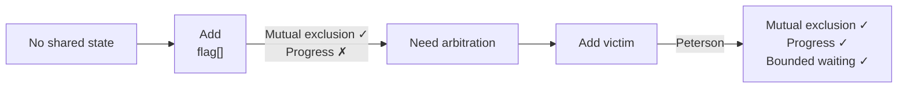

Yes. In fact, these algorithms are best viewed as **examples of synthesizing a lock protocol from minimal atomic shared state**. Historically, they answer the question:

> **"What is the minimum shared state needed to derive mutual exclusion?"**

Each algorithm introduces exactly one new piece of state because the previous one is missing a correctness property.

---

# LockOne

State:

```text
flag[2] : bool
```

Meaning

* `flag[i] = True` means thread `i` intends to enter.

The protocol is



The communication graph is



Each thread only advertises:

> "I'm interested."

There is **no arbitration**.

---

## Failure

Both threads execute

```text
flag=True
```

Result

```text
flag=[True,True]
```

Both observe the other's flag.



---

# LockTwo

State

```text
victim : int
```

Communication



Protocol



Meaning

Each thread says

> "I'll wait if I am the victim."

Notice something strange.

Nobody ever says

> "I actually want the lock."

There is arbitration

but no intent.

---

Failure



---

# Peterson

Peterson composes both ideas.

State

```text
flag[2]
victim
```

Communication graph



State machine



---

Successful contention



---

# The derivation process

You can think of these algorithms as an incremental synthesis:



Each additional shared variable repairs a missing property.

---

# A more abstract view

Viewed algebraically, a lock protocol is a collection of shared state variables together with transition rules.

$$
\text{Lock} = (\text{State},\ \text{Transition},\ \text{Invariant})
$$

For these three algorithms:

| Algorithm | Shared state      | Information represented                               |
| --------- | ----------------- | ----------------------------------------------------- |
| LockOne   | `flag[]`          | **Intent** ("I want the lock")                        |
| LockTwo   | `victim`          | **Arbitration** ("Who yields if there's contention?") |
| Peterson  | `flag[] × victim` | Intent **and** arbitration                            |

In category-theoretic terms, Peterson's lock can be viewed as the **product** of two simpler protocols:

* an **intent protocol** over the Boolean state `flag[]`, and
* an **arbitration protocol** over the `victim` state.

Neither protocol alone satisfies the full specification of mutual exclusion with progress, but their composition does. This illustrates a general engineering pattern: **derive a protocol by composing orthogonal state machines, each responsible for one correctness property**.

This same pattern recurs throughout systems engineering. Modern mutexes, distributed consensus algorithms, transactional databases, and cache-coherence protocols are all built by composing simple coordination mechanisms (intent, ownership, ordering, arbitration, acknowledgment) into a protocol whose global invariants can be proved. Peterson's algorithm is the smallest nontrivial example of this design philosophy.
