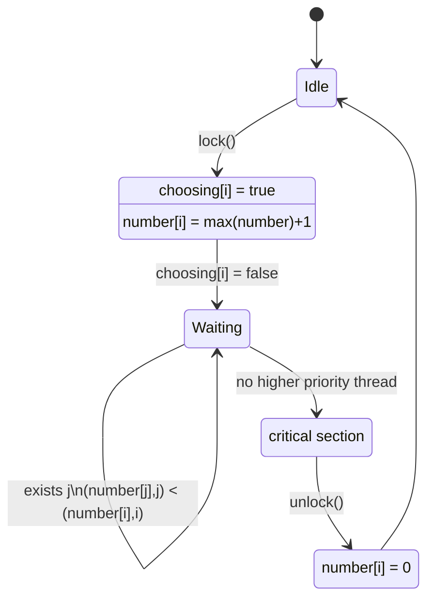
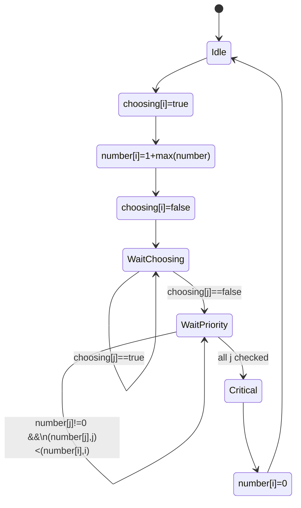
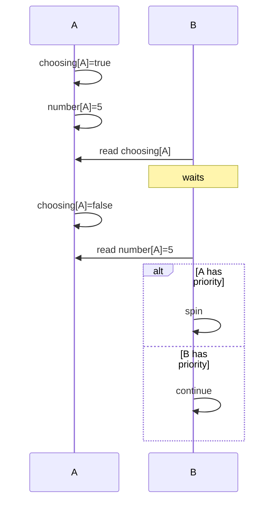

The Bakery algorithm is naturally modeled as **two interacting state machines**:

1. **Per-thread lifecycle** (what each thread does)
2. **Lock protocol** (the doorway and waiting semantics)

The first is usually the most useful.

---

## Expanded version with the doorway made explicit

---

## Protocol interaction between two threads

This illustrates why the `choosing` flag exists.

The critical invariant is:

* `choosing = true` means **ticket is unstable**.
* `choosing = false` means **ticket is finalized**.
* `number = 0` means **not competing**.

---

## Formal state machine

For thread (i), the protocol can be expressed as a finite-state automaton:

[
Q =
{
\text{Idle},
\text{Choosing},
\text{Waiting},
\text{Critical}
}
]

with transitions

[
\begin{aligned}
\text{Idle}
&\xrightarrow{\text{lock}}
\text{Choosing} \
\text{Choosing}
&\xrightarrow{\text{ticket assigned}}
\text{Waiting} \
\text{Waiting}
&\xrightarrow{\forall j,\ (number[j],j)\ge(number[i],i)}
\text{Critical} \
\text{Critical}
&\xrightarrow{\text{unlock}}
\text{Idle}.
\end{aligned}
]

The important insight is that **`Choosing` is a transient "doorway" state, not part of lock ownership**. Ownership begins only upon entering **Critical**, while `number = 0` is what relinquishes ownership.
