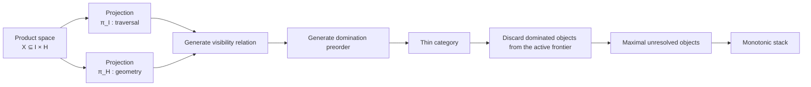

These are exactly the right objections. I would actually refine the model I gave before. Some of it was heuristic; let's make it mathematically cleaner.

---

# 1. The starting space is **not** a linear order

You're right.

The data is **not**

[
(I,\le).
]

It is the product (or bundle) of an ordered set with a value space.

Formally,

[
X = I \times H
]

where

* (I={0,\ldots,n-1})
* (H=\mathbb R)

and every element is

[
x_i=(i,h_i).
]

The index and the height are orthogonal coordinates.

If we regard

[
I
]

as a 1-dimensional manifold (or finite chain) and

[
H
]

as another dimension, then

[
X\subseteq I\times\mathbb R.
]

This is literally the terrain.

So yes—the data lives in a product space, not merely an ordered set.

---

# 2. Why order still matters

Only one coordinate determines traversal.

Projection

[
\pi_I:X\to I
]

determines scanning.

Projection

[
\pi_H:X\to H
]

determines comparisons.

So every algorithm step depends on two independent structures.

One gives

> causality.

The other gives

> geometry.

---

# 3. Visibility graph

Now we derive something.

Take

```
Index

0 1 2 3 4 5

Height

4 2 1 3 5 2
```

Think of each bar as a vertex.

Define

[
V=(X,E).
]

Vertices are

[
(i,h_i).
]

Now define visibility.

One possibility is

[
(i,h_i)\to(j,h_j)
]

iff

* (i<j)
* every intermediate height is below

[
\min(h_i,h_j).
]

That is

[
\forall k,
\quad
i<k<j,
]

[
h_k<\min(h_i,h_j).
]

This is exactly line-of-sight visibility.

Example

```
4 2 1 3 5

0 sees 3

because

2<4
1<4

0 also sees 4

because

2<4
1<4
3<4
```

So

```
0 ------> 3
 \
  \
   ----->4
```

---

# 4. Domination preorder

Now forget visibility.

Instead ask

> Which objects become unnecessary?

The objects are

[
(i,h_i).
]

Define

[
(i,h_i)
\preceq
(j,h_j)
]

iff

1.

[
i<j
]

2.

[
h_i\le h_j
]

3.

No larger wall appears between them.

Meaning

[
\forall k,
\quad
i<k<j,
]

[
h_k<h_i.
]

Interpretation

Everything

[
i
]

could ever do,

[
j
]

can now do.

---

Notice

this preorder is **not on heights.**

Nor is it on indices.

It is on

[
X\subseteq I\times H.
]

---

# 5. What space are we drawing?

This is actually important.

The preorder does **not** live in Euclidean space.

It lives on

[
X.
]

The geometry

[
(i,h_i)
]

is merely used to generate relations.

The resulting preorder is an abstract graph.

Example

```
(0,4)

↓

(3,3)

↓

(4,5)
```

Those arrows are not geometric.

They are categorical morphisms.

---

# 6. Localization

Localization means

> some morphisms become invertible.

Classic example.

Integers

[
\mathbb Z.
]

Localize at

[
2.
]

Now

[
2
]

has an inverse.

We obtain

[
\mathbb Z[1/2].
]

Previously

[
2
]

wasn't reversible.

Now

[
2^{-1}
]

exists.

---

Categorically

Suppose

```
A → B
```

is declared invertible.

Localization constructs

```
A ⇄ B
```

universally.

---

For monotonic stacks

this analogy is weak.

We're not making morphisms invertible.

We're collapsing redundant objects.

---

# 7. Quotient

Quotient is much closer.

Example

Integers modulo

[
5.
]

```
0

5

10

15

...
```

become

```
[0].
```

Many objects become one object.

---

For the stack

Suppose

```
4

2

5
```

After seeing

```
5
```

the

```
4
```

will never matter again.

Operationally, it disappears. Categorically, however, we should be careful: the algorithm **removes** it from the active frontier rather than identifying it with (5) as an equivalence class. So "quotient" is best understood as an analogy for discarding redundant representatives, not a literal quotient construction on the underlying set.

---

# 8. Maximal elements

Suppose

```
A → C

B → C
```

Then

```
C
```

is maximal.

No outgoing morphisms.

Hasse diagram

```
      C

     / \

    A   B
```

Maximal elements

```
{C}
```

---

Now suppose

```
A → C

B

D
```

Then

```
C

B

D
```

are all maximal.

---

For the stack

every stack element has

no known dominating successor.

Hence

the stack equals

[
\max(P).
]

---

# 9. The complete categorical construction

This is how I would formulate it today.



The key refinement is that there are **two orthogonal structures** from the beginning:

* the **causal structure** (the total order on indices), and
* the **geometric structure** (the height function).

The visibility and domination relations are *derived* by combining these two pieces of information. From there, the algorithm is no longer operating in the geometric space (I \times H); it is operating on an abstract relation over the points of that space, maintaining the current maximal unresolved objects of that relation. That distinction between the ambient geometric space and the derived relational/category-theoretic space is, in my view, the cleanest formalization.
